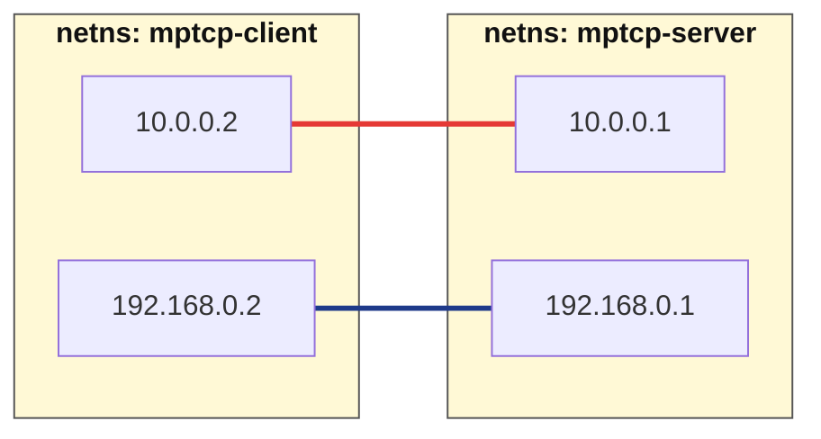
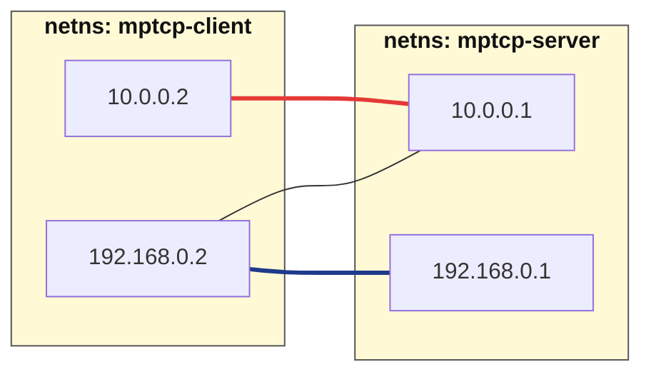
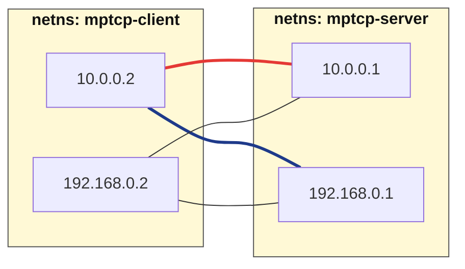
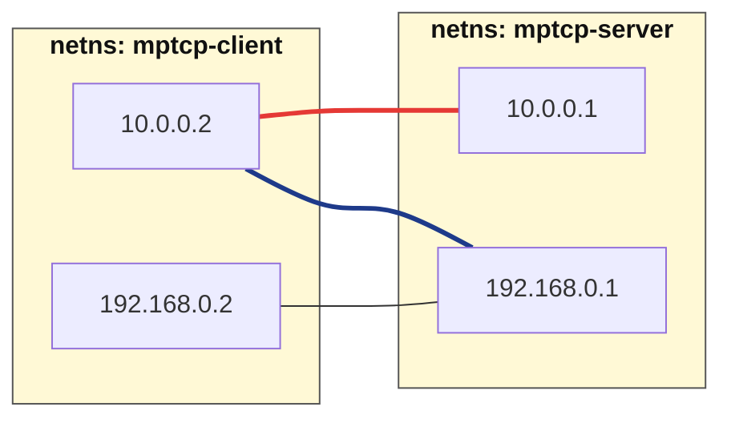

# simple case

simple caseはsubflowの挙動を理解するためにシンプルな例を示します。
具体的には以下のトポロジーで動作するMPTCPの例をnetns上で動かして動作を理解します。



なお、[Multipath TCP on RHEL 8: From one to many subflows](https://developers.redhat.com/articles/2021/10/20/multipath-tcp-rhel-8-one-many-subflows#working_with_multiple_paths)を参考に、ubuntu環境で動かせる様にしたものです。


## 事前準備
```shell
# netnsを利用して簡単な仮想的なトポロジーを作ります
sudo ./topo.sh
```

## 基本的な実験の動作
### 手動での簡単な実験の仕方
以下のバイナリはmptcpizeを使ってMPTCP化した上で動いています。
```shell
# step1: サーバ側で待ち受け
sudo ip netns exec mptcp-server mptcpize run \
ncat -k -4 -i 30 -c "sleep 60" -C -o /tmp/server -l 0.0.0.0 4321

# step2: パケットキャプチャ(別ターミナルから実行)
sudo ip netns exec mptcp-server tcpdump -i any -w /tmp/mptcp.pcap 'tcp port 4321' -c 50

# step3: mptcpの動作状態が見える(別ターミナルから実行)
sudo ip netns exec mptcp-client ip mptcp monitor

# step4: クライアントから1本目経路で接続して送信(別ターミナルから実行)
sudo ip netns exec mptcp-client mptcpize run \
ncat -c "echo hello world!" 10.0.0.1 4321
```

### Goのサーバーを利用した簡単な実験の仕方
```shell
# バイナリをbuildしておく
make build

# step1: サーバ起動（mptcp-server NS内）
sudo ip netns exec mptcp-server ../../out/bin/server -addr "0.0.0.0:4321"

# step2: パケットキャプチャ(別ターミナルから実行)
sudo ip netns exec mptcp-server tcpdump -i any -w /tmp/mptcp.pcap 'tcp port 4321' -c 50

# step3: mptcpの動作状態が見える(別ターミナルから実行)
sudo ip netns exec mptcp-client ip mptcp monitor

# step4: クライアントから1本目経路で接続して送信(別ターミナルから実行)
sudo ip netns exec mptcp-client ../../out/bin/client \
-addr "10.0.0.1:4321" -msg "hello from go client"
```

### 終了方法
```shell
sudo ./rmtopo.sh
```

## Subflowの作られ方を知るための実験
手動でもGoでもやってることは基本同じなので共通のモノとして説明します。

ここで知ってもらいたいのは、Subflowがどの様に追加されていくかということです。
それを知るためには `ip mptcp monitor` が非常に便利です。

以下にはsubflowのパターンを変えた時のmonitorデータを用意しています。

### 1.ディフォルトのパターン
1つ目が以下のパターンです
- 単純にclientが持つIP Address 2つにsubflowを割り当てる
- serverの2つ目のIP Addressをclientに通知する

素直に作った時の条件という感じですね。
そのsubflowの作られた結果がこれです。
```shell
$ sudo ip netns exec mptcp-client ip mptcp monitor
[       CREATED] token=867717f1 remid=0 locid=0 saddr4=10.0.0.2 daddr4=10.0.0.1 sport=46522 dport=4321
[   ESTABLISHED] token=867717f1 remid=0 locid=0 saddr4=10.0.0.2 daddr4=10.0.0.1 sport=46522 dport=4321
[     ANNOUNCED] token=867717f1 remid=1 daddr4=192.168.0.1 dport=4321
[SF_ESTABLISHED] token=867717f1 remid=1 locid=1 saddr4=192.168.0.2 daddr4=192.168.0.1 sport=36969 dport=4321 backup=0
[SF_ESTABLISHED] token=867717f1 remid=0 locid=1 saddr4=192.168.0.2 daddr4=10.0.0.1 sport=44653 dport=4321 backup=0 ifindex=3
[        CLOSED] token=867717f1
```

ログを読み解くと、この場合としてできたsubflowは以下の組み合わせになります。
- saddr4=10.0.0.2 daddr4=10.0.0.1 (initで出来たsubflow)
- saddr4=192.168.0.2 daddr4=192.168.0.1 (「initでクライアントで利用してないAddr」と「通知されたAddr」の組みで出来たsubflow)
- saddr4=192.168.0.2 daddr4=10.0.0.1(「initでクライアントで利用してないAddr」と「initで接続した時に使ったAddr」の組みで出来たsubflow)


### 2.fullmeshのケース

`saddr4=10.0.0.2 daddr4=192.168.0.1`というinitで使ったIfaceと通知されたAddrとの組みを作るにはどうしたらいいか？
そこで使えるのが`fullmesh` optionです。topo.shの当該部分を以下の様に変更します。
```diff
- ip netns exec mptcp-client ip mptcp endpoint add 192.168.0.2 dev blue-client subflow
- ip netns exec mptcp-client ip mptcp endpoint add 10.0.0.2 dev blue-client subflow
+ ip netns exec mptcp-client ip mptcp endpoint add 192.168.0.2 dev blue-client subflow fullmesh
+ ip netns exec mptcp-client ip mptcp endpoint add 10.0.0.2 dev blue-client subflow fullmesh
```

そうすると以下の様な結果が出てることがわかります。
```shell
$ sudo ip netns exec mptcp-client ip mptcp monitor
[       CREATED] token=1ded7bb8 remid=0 locid=0 saddr4=10.0.0.2 daddr4=10.0.0.1 sport=55152 dport=4321
[   ESTABLISHED] token=1ded7bb8 remid=0 locid=0 saddr4=10.0.0.2 daddr4=10.0.0.1 sport=55152 dport=4321
[     ANNOUNCED] token=1ded7bb8 remid=1 daddr4=192.168.0.1 dport=4321
[SF_ESTABLISHED] token=1ded7bb8 remid=1 locid=1 saddr4=192.168.0.2 daddr4=192.168.0.1 sport=59813 dport=4321 backup=0 ifindex=3
[SF_ESTABLISHED] token=1ded7bb8 remid=1 locid=0 saddr4=10.0.0.2 daddr4=192.168.0.1 sport=33681 dport=4321 backup=0 ifindex=2
[SF_ESTABLISHED] token=1ded7bb8 remid=0 locid=1 saddr4=192.168.0.2 daddr4=10.0.0.1 sport=57831 dport=4321 backup=0 ifindex=3
[        CLOSED] token=1ded7bb8
```

ログよりESTABLISHED x1 + SF_ESTABLISHED x3 なのでFullmeshになってることがわかりますね！


### 3.　init subflow(MP_CAPABLE)が行われたところのip:portにはsubflowを作らないパターン
ここまで二つのパターンを見ましたが、実用的なことを考えると違うパターンが欲しくなります。
例えば、[draft-duchene-mptcp-load-balancing-01](https://datatracker.ietf.org/doc/html/draft-duchene-mptcp-load-balancing-01)で提案されてたLBのパターンというのは以下の様な制御が出来ないと実現できません。
- initのsubflowはLBを通す
- add_addrされたものに接続するが、add_addrで送るものはLBを通さないアドレスで行う

つまり、今までのパターンから考えるに、initのsubflowで使った `addr:port` の組みに対してinit以外のsubflowを作らなければ良いということです。

そのために以下のoptionを `topo.sh` に追加します。
これはclientに対してinitial subflowで使用されたAddr:portには新たなsubflowを許可しない様に要求するというoptionです。
で先ほどの項目2のパターンに以下のoptionを追加してみましょう。
```diff
+ ip netns exec mptcp-server sysctl -w net.mptcp.allow_join_initial_addr_port=0
```

結果として以下のログを得ることができました。
```shell
$ sudo ip netns exec mptcp-client ip mptcp monitor
[       CREATED] token=7b0b96fe remid=0 locid=0 saddr4=10.0.0.2 daddr4=10.0.0.1 sport=38084 dport=4321
[   ESTABLISHED] token=7b0b96fe remid=0 locid=0 saddr4=10.0.0.2 daddr4=10.0.0.1 sport=38084 dport=4321
[     ANNOUNCED] token=7b0b96fe remid=1 daddr4=192.168.0.1 dport=4321
[SF_ESTABLISHED] token=7b0b96fe remid=1 locid=1 saddr4=192.168.0.2 daddr4=192.168.0.1 sport=40559 dport=4321 backup=0 ifindex=3
[SF_ESTABLISHED] token=7b0b96fe remid=1 locid=0 saddr4=10.0.0.2 daddr4=192.168.0.1 sport=45031 dport=4321 backup=0 ifindex=2
```

組み合わせとしては以下の様になります。
- saddr4=10.0.0.2 daddr4=10.0.0.1
- saddr4=192.168.0.2 daddr4=192.168.0.1
- saddr4=10.0.0.2 daddr4=192.168.0.1

これによってLBのVIPを2本目のsubflowは通らせずにsubflowを貼ることができてるのがわかります。



ちなみに `fullmesh` を解除した状態だと、それぞれiface同士に紐づく様になります
```shell
$ sudo ip netns exec mptcp-client ip mptcp monitor
[       CREATED] token=184dcfad remid=0 locid=0 saddr4=10.0.0.2 daddr4=10.0.0.1 sport=59676 dport=4321
[   ESTABLISHED] token=184dcfad remid=0 locid=0 saddr4=10.0.0.2 daddr4=10.0.0.1 sport=59676 dport=4321
[     ANNOUNCED] token=184dcfad remid=1 daddr4=192.168.0.1 dport=4321
[SF_ESTABLISHED] token=184dcfad remid=1 locid=1 saddr4=192.168.0.2 daddr4=192.168.0.1 sport=59209 dport=4321 backup=0
[        CLOSED] token=184dcfad
```


